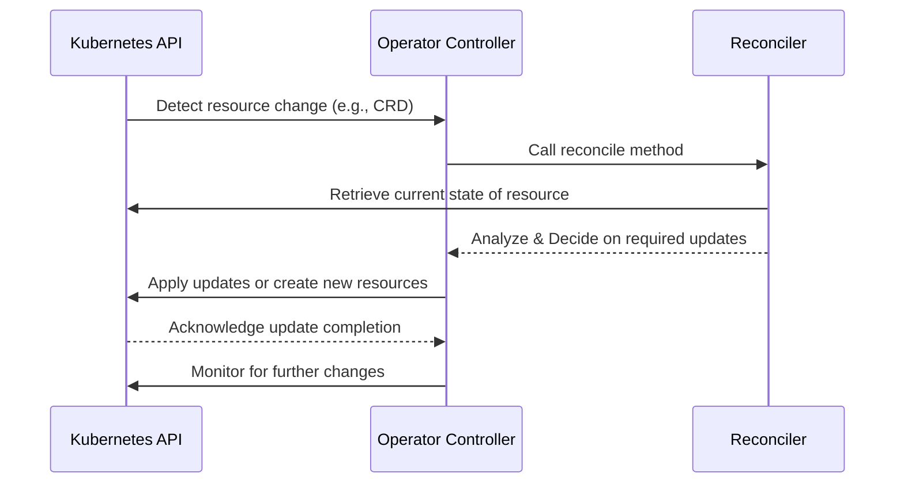

# Generated Project Skeleton

A simple operator that copies the value in a spec to a ConfigMap. 

Spring Boot Opreator
---
本项目为 [java-operator-sdk](https://github.com/operator-framework/java-operator-sdk) 构造的 K8S Operator 项目
旨在实现一个 **Spring Boot** 容器的 _K8S_ 应用快速部署
以模板的方式定义资源, 做到最小配置快速上线

## 项目结构
```
├─src
│  ├─main
│  │  ├─java
│  │  │  └─com
│  │  │      └─xx
│  │  │          ├─conditions           -- 条件相关, 如是否需要部署 ingress
│  │  │          ├─consts               -- 常量定义
│  │  │          ├─customresource       -- CRD 定义
│  │  │          ├─dependents           -- 依赖相关
│  │  │          ├─reconciler           -- Reconciler 实现 (控制器)
│  │  │          └─utils                -- 工具包
│  │  └─resources
│  │      └─com
│  │          └─xx                      -- kubernetes 模板文件
```


## 如何使用本项目
### 前置条件
1. JDK 17+
2. Maven 3.8+
3. Docker 20+ (Optional)

### 运行时序图
- `Kubernetes API` 负责资源变化的检测和响应。
- `Controller` 持续监听资源变化，触发 `Reconciler` 来处理。
- `Reconciler` 读取和分析当前资源状态，决定是否更新或创建新的资源。


### 生成 CRD 资源
运行 `mvn clean compile package -DskipTests` 生成 CRD 资源文件, 资源默认生成在 `target/classes/META-INF/fabric8` 目录下.
该目录下会生成 2 个CRD资源文件: 

> 注意, v1beta1 是为了兼容老版本, K8S 版本在 1.22 之后移除了 `apiextensions.k8s.io/v1beta1`
如果你的 _K8S_ 版本在 _1.22_ 之后, 请使用 `v1`

```
springboots.com.xx-v1.yml
springboots.com.xx-v1beta1.yml
```

将这2个文件在你所在的 **K8S** 集群部署:
```shell
kubectl apply -f springboots.com.xx-v1.yml
```

### 打包 & 运行
运行以下命令,生成镜像文件
```shell
docker build --network host -t springboot-operator:1.0.0 .
```

将本项目中的 `k8s` 文件夹中的 `operator-*.yml` 文件部署到集群中, 注意修改其中的镜像相关信息


### 配置说明
> 本 **Operator** 仅支持 **Deployment** 类型的 Spring Boot 应用, 详细的配置请查看代码 `com.xx.customresource.SpringBootOperatorSpec` 注释